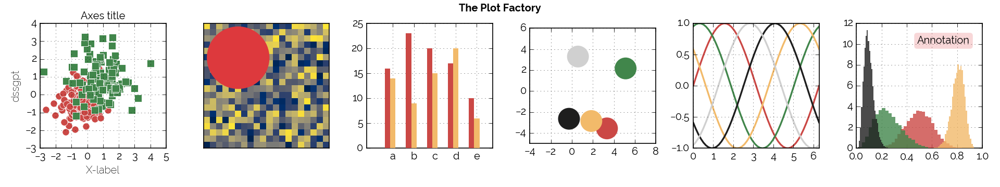
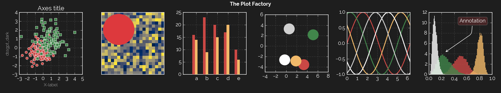

# mpl-dssg

## 🤔 Context

A Matplotlib style based on [Data Science for Social Good Portugal](https://www.dssg.pt)'s brand, offered in both light and dark versions.

## 🎨 Styles

Under the `styles` folder, 3 style files (`.mplstyle`) can be found: 

- `dssgpt.mplstyle`: the default light style.

- `dssgpt_dark.mplstyle`: an alternative black style.

- `template.mplstyle`: a generic theme template ready for customization (upon which the two styles above were based), included out of convenience.

The theme expects the Raleway typeface, [available for download under an Open Font Licence on Google Fonts](https://fonts.google.com/specimen/Raleway). It will, however, gracefully fail and swith to the system's default non-serif font if Raleway is not present. 

The file `visualize.py` includes the code to generate the visualizations above. Code is heavily adapted from Matplotlib's [Style sheets reference](https://matplotlib.org/stable/gallery/style_sheets/style_sheets_reference.html) snippet. 

## 🔧 Installation 

### Quick'n'dirty

Dynamically load the theme (from GitHub, even) without a prior install: 

```Python

# For the light version
plt.style.use('https://raw.githubusercontent.com/dssg-pt/mpl-dssg/main/styles/dssgpt.mplstyle') 

# For the dark version
plt.style.use('https://raw.githubusercontent.com/dssg-pt/mpl-dssg/main/styles/dssgpt_dark.mplstyle') 

# Do Matplotlib stuff

```

### The proper way

From a Python shell, locate the folder where Matplotlib's themes are located and add the `.mplstyle` files there: 

```Python

import matplotlib
import matplotlib.pyplot as plt

# Get the location of Matplotlib's configuration folder
print(matplotlib.get_config_dir()) 

# In that folder, create, if needed, a 'stylelib' folder and move the .mplstyle files there. Themes
# should now be available: 

plt.style.use('dssgpt') # or 'dssgpt_dark'

# And now do Matplotlib stuff

```

## 📋 License 

This project is licensed under the terms of the MIT license.
